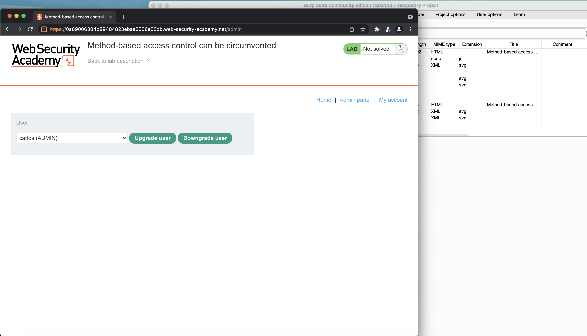
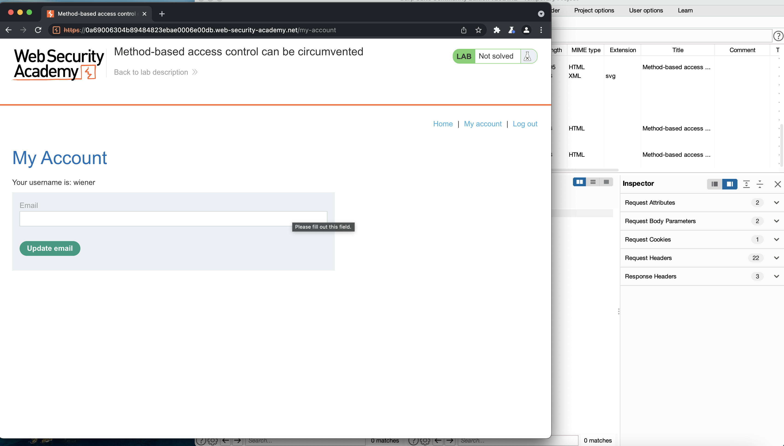
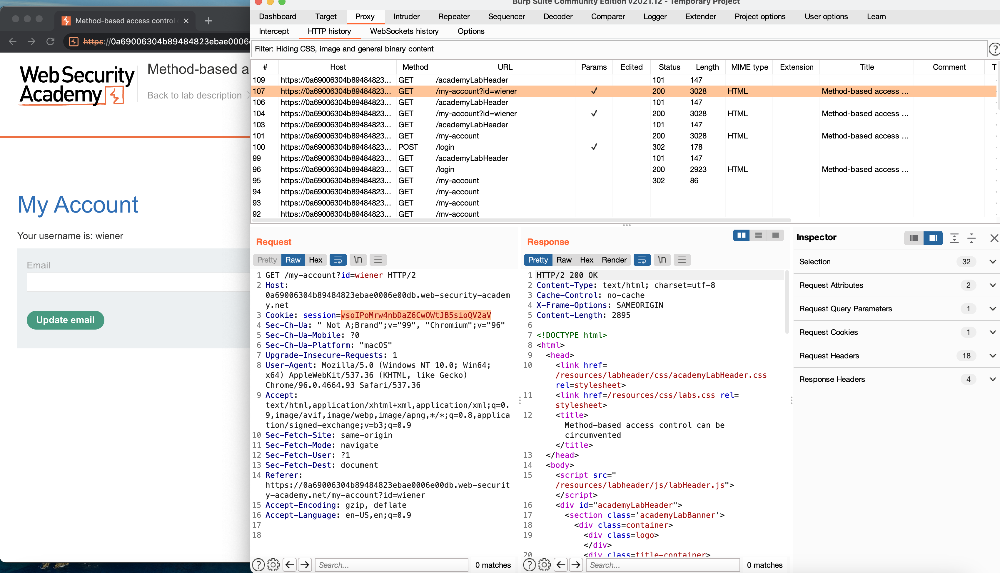
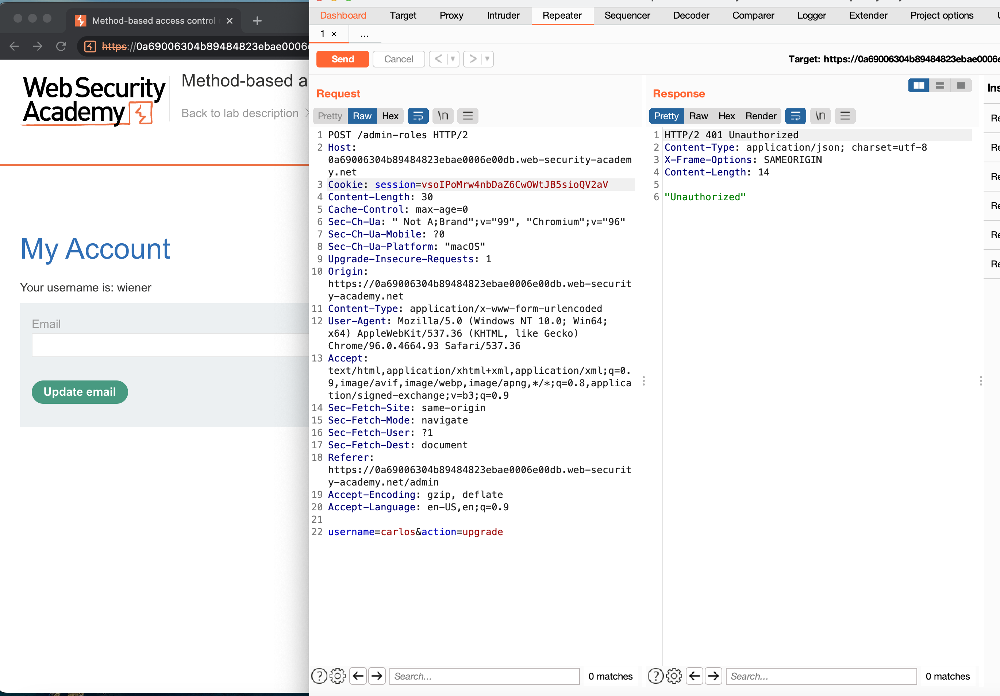
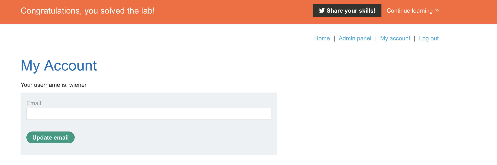

# Method-Based Access Control Can Be Circumvented

This repository is solution to assignment on Data Security Course. It is a portswigger [Lab](https://portswigger.net/web-security/access-control/lab-method-based-access-control-can-be-circumvented) which was assigned to me to solve.

# Description

This lab implements access controls based partly on the HTTP method of requests. You can familiarize yourself with the admin panel by logging in using the credentials `administrator:admin`.

To solve the lab, log in using the credentials `wiener:peter` and exploit the flawed access controls to promote yourself to become an administrator. 

# Solution

First we are going to login to admin panel to see how it operate. For instance I promoted carlos to be an admin. I copied the request to repeat it again.

now we logout from administrator and login with the `wiener:peter`. As we can see there is no admin panel enabled on this account.

We try to repeat the last request with this account session and username, but it gives us error of `unauthorized`.

What we do here is to change the method of http request to `GET` and what we get is an bug on access control via http-method.

# Result

Lab is solved and our user promoted to admin.

